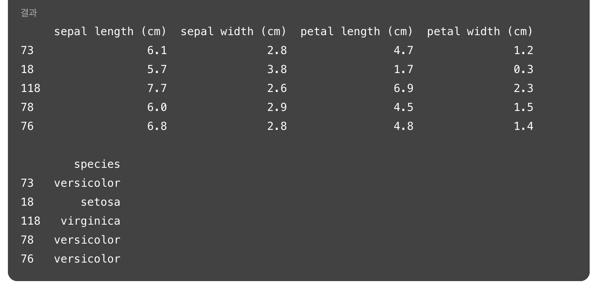

## learning-AI : AI-101 (13119003)
### topic 1 : 머신러닝, 딥러닝 기본 개념 정리 

<br>

- **임규연 (lky473736)**
- 2025.03.04.

------

### FAQ

- https://github.com/MyungKyuYi/AI-class/blob/main/README.md
- 중간고사, 기말고사에 출제됨
```
    인공지능 기초를 위한 FAQ

    1. 인공지능에서 지능에 해당하는 기능은 무엇인가?
    2. 인공지능의 종류 3가지에 대해서 설명하시오 (지도학습, 반지도학습, 강화학습)
    3. 전통적인 프로그래밍 방법과 인공지능 프로그램의 차이점은 무엇인가?
    4. 딥러닝과 머신러닝의 차이점은 무엇인가?
    5. Classification과 Regression의 주된 차이점은?
    6. 머신러닝에서 차원의 저주(curse of dimensionality)란?
    7. Dimensionality Reduction는 왜 필요한가?
    8. Ridge와 Lasso의 공통점과 차이점? (Regularization, 규제 , Scaling)
    9. Overfitting vs. Underfitting
    10. Feature Engineering과 Feature Selection의 차이점은?
    11. 전처리(Preprocessing)의 목적과 방법? (노이즈, 이상치, 결측치)
    12. EDA(Explorary Data Analysis)란? 데이터의 특성 파악(분포, 상관관계)
    13. 회귀에서 절편과 기울기가 의미하는 바는? 딥러닝과 어떻게 연관되는가?
    14. Activation function 함수를 사용하는 이유? Softmax, Sigmoid 함수의 차이는? 
    15. Forward propagation, Backward propagation이란?
    16. 손실함수란 무엇인가? 가장 많이 사용하는 손실함수 4가지 종류는?
    17. 옵티마이저(optimizer)란 무엇일까? 옵티마이저와 손실함수의 차이점은?
    18. 경사하강법 의미는? (확률적 경사하강법, 배치 경사하강법, 미치 배치경사하강법)
    19. 교차검증, K-fold 교차검증의 의미와 차이
    20. 하이퍼파라미터 튜닝이란 무엇인가?
    21. CNN의 합성곱의 역활은?
    22. CNN의 풀링층의 역활은?
    23. CNN의 Dense Layer의 역활은?
    24. CNN의 stride, filter의 역활? 필터의 가중치는 어떻게 결정되는가?
    25. RNN을 사용하는 이유와 한계점은?
    26. LSTM을 사용하는 이유와 한계점은?
    27. GRU을 사용하는 이유와 차별성은?
    28. 결정트리에서  불순도(Impurity) - 지니 계수(Gini Index)란 무엇인가?
    29. 앙상블이란 무엇인가?
    30. 부트 스트랩핑(bootstraping)이란 무엇인가?
    31. 배깅(Bagging)이란 무엇인가?
    32. 주성분 분석(PCA) 이란 무엇인가?
    33. Dense Layer란 무엇인가?    
```

### 숙제
- FAQ - 14번 ~ 27번, 33번 : 리포트 쓰기 (수기로 써서 사진 찍어서)
- iris data 이용해서 ML 복습 (https://archive.ics.uci.edu/dataset/53/iris)
    - KNN, LR, DT, RF, SVM 

<br>

### AI란 (전통적 프로그래밍 vs 인공지능)


- **AI : 데이터의 특성(feature)을 잘 분석하는 기계**
    - 결국에 AI은 세 줄 : 모델 만들기 -> fit -> evaluate (predict)
- 전통적인 프로그래밍과 인공지능 프로그래밍의 차이
    - 전통적인 프로그래밍 : 규칙, rule을 프로그래머가 프로그램에 직접 대입하여야 했음  
        - rule : 입력 데이터의 속성을 추출하는 것 (데이터의 확률분포를 파악하는 요소)
        - 알맞은 데이터 입력 -> 알맞은 target 출력함 (garbage in, garbage out)
    - **AI 프로그래밍 : 데이터를 입력하면 rule을 자체적으로 생성 (이 자체가 학습)**
        - X와 y를 입력하면 rule을 생성한다
            - 위에서 feature가 X (sepal length, width, ...), label이 y (species)
            - 예측값과 실제값의 차이를 비교하여 acc, f1, precision, recall이라는 지표

<br>

### AI에서의 데이터 입력 방법
- (1) 파일로부터 받는다 (csv, text...)
- (2) 라이브러리에 자체 내장 (MNIST)
- (3) 웹주소로 받음
- 데이터 분할 
    - X, y로 나눈다 
    - train : test = 7 : 3

<br>

### 딥러닝과 머신러닝의 차이점
- 인공지능 : 많은 알고리즘 내포 (유전자 알고리즘, https://ko.wikipedia.org/wiki/%EC%9C%A0%EC%A0%84_%EC%95%8C%EA%B3%A0%EB%A6%AC%EC%A6%98)
    - 규칙 기반 : 전문가 시스템, 초창기의 인공지능
        - rule을 계속 추가하면 한도 끝도 없다 -> 전문가 시스템이 망함
    - 통계 기반
    - 신경 기반
- 머신러닝 : 어떤 특징을 추출 -> 모델에 대입 -> 학습
- 딥러닝 : 특징 추출과 학습을 동시에 진행한다. (모델 자체에서)
    - 딥러닝은 입력과 출력 사이의 rule (f(x))를 구하는 것, 데이터의 특성을 발견해서 출력을 예측하는 것
        - 방법 1. weight와 bias를 구하는 것
        - 방법 2. 확률적 모델 (데이터 분포 예측, stochastic model)
