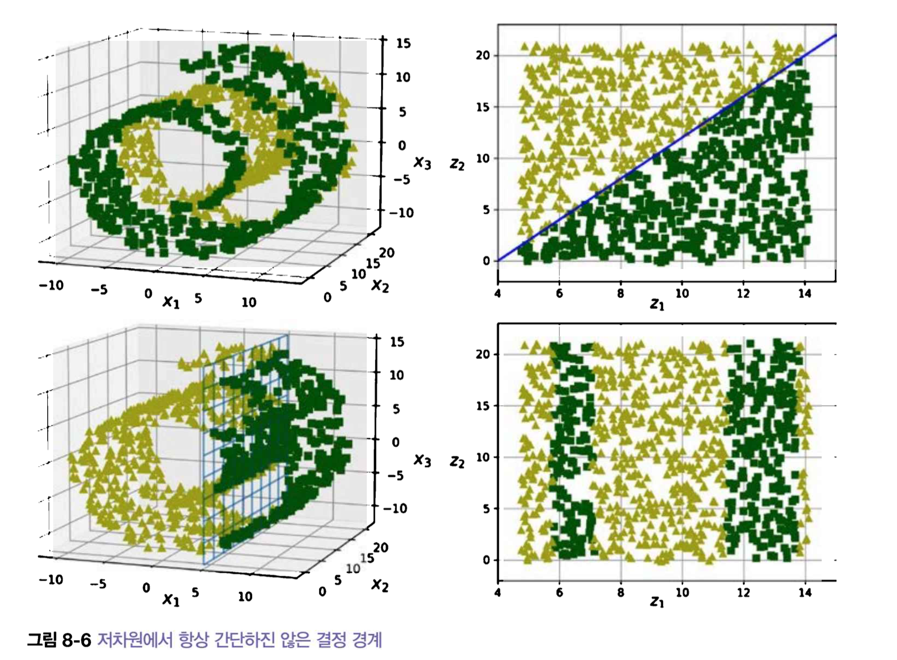
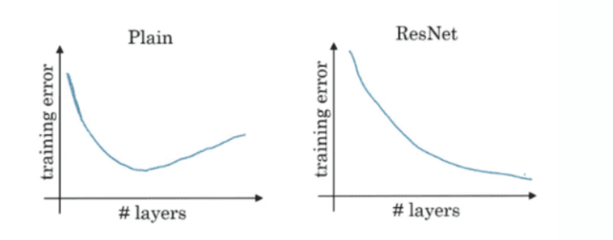
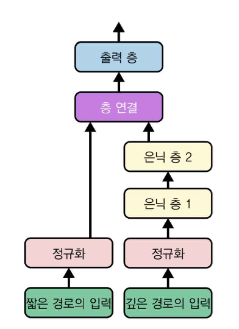
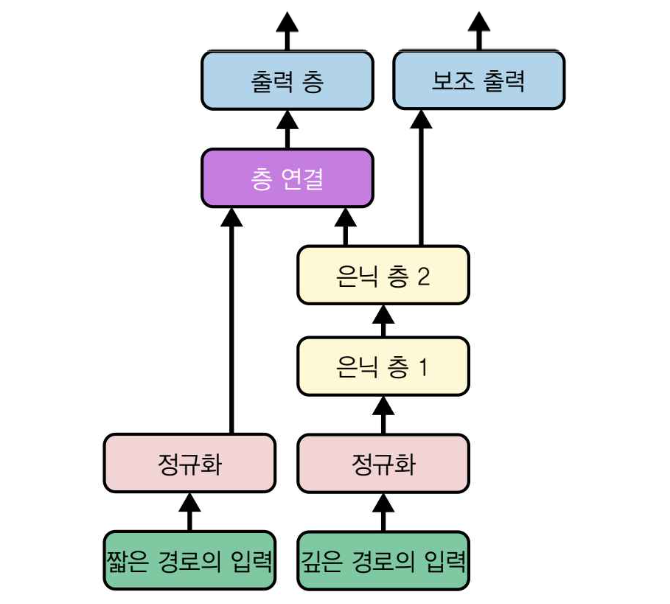
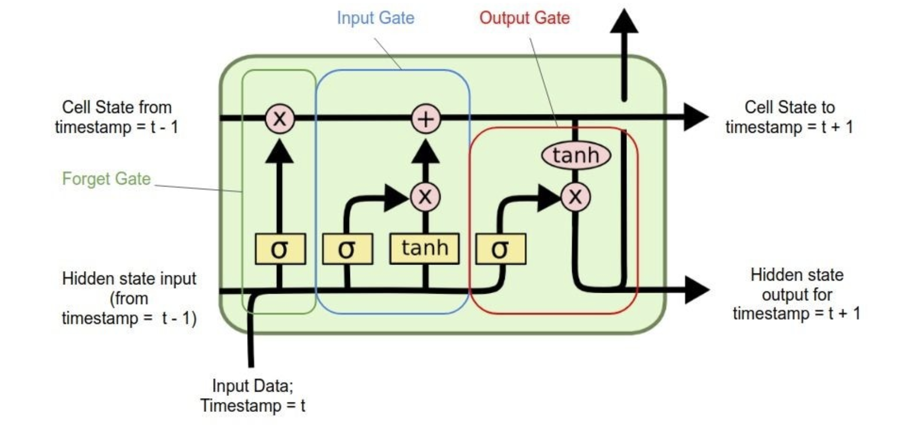

## learning-AI : deep learning application (61357002)
### topic 2 : FAQ를 통한 머신러닝, 딥러닝 기본 개념 정리 2 

<br>

- **임규연 (lky473736)**
- 2024.09.12.

------

### FAQ
    - https://github.com/lky473736/learning-AI/blob/main/FAQ.md
    - https://github.com/MyungKyuYi/AI-class/blob/main/README.md
    - 중간고사, 기말고사에 출제됨
    
### **일련의 tips**
- pd.read_csv에서 index_col=0을 하는 이유 : Unnamed :0가 가끔씩 나오기 때문에 이를 방지하기 위함
- 만약에 classification에서 label이 0-based가 아니거나, 불연속적일 때 : label-encoder로 0-based로 만들어주기
- 인덱스를 feature에 넣지 말아야 할 이유
    - id를 넣어봤자 차원만 늘어날 뿐임 (curse of dimensinality -> overfitting 야기)
- 파일을 읽어들였을 때 해야할 것
    - 이상이 있나 없나 (결측치, 이상치)
    - encoding
    - target countplot
- 모델 저장
    - save_model을 할 때 저장되는 값들 : weight, bias, 모델 파라미터...
    - 굳이 모델 저장하는걸 매번 할 필요 없음 (매번마다 다르니깐)
        - 하지만 **전이 학습**은 반드시 모델을 저장해놔야함
            - 전이 학습 : 신경망을 재사용하는 것
            - 재사용하는 이유 : 앞에서는 일반적인 특성을 추출하고, 뒤에서는 추상적인 특성을 추출하니깐 전이 학습 도입하여 편하게 함

<br>

### 차원의 저주
- feature의 갯수가 너무 많아서 모델이 데이터의 패턴을 파악하기 어려울 때
- 해결책    
    - **heatmap**을 구해서 상관계수를 보고 feature selection
        - 사실 feature의 조합을 모두 조합해서 학습해보고 점수를 비교해보면 된다.(wrapper)
            - 이러면 속도가 너무 저하되고 오래 걸림
        - **PCA** 를 이용한다
    - 궁극적으로 차원을 줄인다. (dimensionality reduction)

<br>

### manifold learning



- 고차원에서는 결정 경계가 너무 명확하지 않다. 너무 복잡하다.
- **아무리 복잡한 데이터 (고차원) 이더라도 데이터 분석을 하여 특정 dimension으로 줄이면 파악하기 쉽다.**
- 매니폴드 **가정** : 실제 고차원 데이터가 저차원 데이터에 가깝게 놓여 있다고 가정하는 것임
- 예시 (차원 축소 알고리즘)
    - 스위스 롤 (2D manifold)
    - PCA

<br>

### PCA

- https://bkshin.tistory.com/entry/%EB%A8%B8%EC%8B%A0%EB%9F%AC%EB%8B%9D-9-PCA-Principal-Components-Analysis
- train set에서 분산이 최대인 축을 찾기
- **t-SNE**

<br>

### 딥러닝 개요
- 필수 요소
    - optimizer
    - loss function
    - back propagation
    - forward propagation
    - one-hot encoding
- dense layer를 FCNN이라고도 한다 (full connected neural network)
- **모델의 복잡성을 늘린다는 것이 꼭 그렇게 좋은 것은 아님**
    - gradient vanishing problem
        - layer을 너무 깊게 쌓아서 미분하니 0에 수렴하는 문제 발생
        - 해결책
            - node수를 줄이거나, 모델을 작게 만들거나
            - **예시 : ResNet에서 skip connection (shortcut) 도입**
                - **plain model과 잔차를 도입한 Resnet의 안정성 비교**
                
### 여러개의 입력, 여러개의 출력을 다루는 딥러닝

#### 입력이 여러개고, 출력이 1개


- 입력이나 출력은 몇개도 될 수 있다. 
    - **단, 중간에 concatenate 이용하면 붙이기**
    - 위 소스를 확인해볼 때, feature을 겹쳐서 입력하였는데 이래도 아무 문제 없음

```python
input_wide = tf.keras.layers.Input(shape=[5])  # 특성 0 ~ 4
input_deep = tf.keras.layers.Input(shape=[6])  # 특성 2 ~ 7
norm_layer_wide = tf.keras.layers.Normalization()
norm_layer_deep = tf.keras.layers.Normalization()
norm_wide = norm_layer_wide(input_wide)
norm_deep = norm_layer_deep(input_deep)
hidden1 = tf.keras.layers.Dense(30, activation="relu")(norm_deep)
hidden2 = tf.keras.layers.Dense(30, activation="relu")(hidden1)
concat = tf.keras.layers.concatenate([norm_wide, hidden2])
output = tf.keras.layers.Dense(1)(concat)
model = tf.keras.Model(inputs=[input_wide, input_deep], outputs=[output])
```

#### 입력이 여러개고, 출력도 여러개



```python
optimizer = tf.keras.optimizers.Adam(learning_rate=1e-3)
model.compile(loss=("mse", "mse"), loss_weights=(0.9, 0.1), optimizer=optimizer,
              metrics=["RootMeanSquaredError", "RootMeanSquaredError"])
    # 각 출력층마다 loss랑 weights가 다르다는 것에 주목
```

<br>

### CNN 기본

- CNN reference
    - https://www.freedium.cfd/https://towardsdatascience.com/deep-learning-illustrated-part-3-convolutional-neural-networks-96b900b0b9e0
    - https://www.freedium.cfd/https://towardsdatascience.com/understanding-your-convolution-network-with-visualizations-a4883441533b
    - https://www.freedium.cfd/https://medium.com/@koushikkushal95/understanding-convolutional-neural-networks-cnns-in-depth-d18e299bb438
    - https://www.freedium.cfd/https://medium.com/ai-mind-labs/convolutional-neural-networks-explained-a-hands-on-guide-7de893629686
- CNN을 사용하는 이유
    - 공간적인 정보 또한 학습시키는 것 (local feature을 추출하기 위함)
    - filtering을 위함 (feature extraction)
        - 처음에는 filter값이 랜덤 (**처음에 특정 filter을 넣을 수도 있음**)
        - 학습을 통하여 filter값을 최적화함 
    - 사용 목적
        - 이미지와 같이 부분적인 정보 추출을 할 때, DNN은 부적합 -> convolution 연산을 사용함
        - 이미지 부분에 필터를 곱해서 convolution 연산을 수행 -> 중요한 feature extraction -> regression/classification이 용이해짐
    - 전체 정보가 한 뉴런에 들어가면 굉장히 학습율이 떨어짐 -> 부분적인 학습으로 각 이미지를 영역으로 seperate하여 학습하는 것이 중요
- stride (stride이 적을 수록 구해지는 정보가 많아짐), padding, filter (1, 3, 5, 7, 9...)
- filter를 움직이는 stride
- filter값은 초기에 랜덤하게 정해짐 -> 데이터를 잘 설명할 수 있는 최적값으로 update됨 (back-propagation을 통하여 각 component가 결정되는 것)
- convolutional layer -> pooling 
    - 정보 압축 (parameter 줄이고, 성능 높이기 + 크기 줄이기)
    - pooling의 역할 
        - 평행 이동 불변
        - 정보 요약
    - pooling의 장점 : 물체의 이동에 대하여 둔감하게 하는 것 

<br>

### RNN 기본

- RNN Reference
    - https://www.freedium.cfd/https://medium.com/learn-love-ai/introduction-to-recurrent-neural-networks-rnns-43238d037a5c
    - https://www.freedium.cfd/https://towardsdatascience.com/deep-learning-illustrated-part-4-recurrent-neural-networks-d0121f27bc74
    - https://www.freedium.cfd/https://medium.com/ai-in-plain-english/lstm-architecture-in-simple-terms-491570fae6f0

- DNN, CNN은 데이터의 추세성을 반영한 것이 아니다. 이전의 시점을 반영하는 것도 아니다. 
- 전에 있었던 데이터를 통하여 다음 데이터를 예측하는 모델 (이전 시점을 반영)
    - 시계열 데이터, 주식 데이터, EMG, HARTH...
    - 어제 시장가를 확인한 후에 오늘 매각할지 매수할지를 결정하는 것처럼

- 순환 데이터
    - 순환 데이터를 고려할 때, regression인 경우엔 window 수 + 다음 수로 데이터를 만들면 됨.
    - classification이면 class의 갯수가 많은 것 or 맨 끝의 것
        - 0 1 1 1
        - 많은 것이 1, 끝의 것이 1

- RNN의 단점
    - 미분값의 손실 (기울기 소실) -> 문장이 길어지면 기울기 소실이 일어남
        - **LSTM의 등장**

<br>

- **LSTM**



    - reference
        - TinyML pdf file 

    - short term뿐만이 아닌 long term까지 학습
        - short term은 현재 학습하는 시계열의 시간 t
        - long term은 여태껏 학습해온 시계열들의 정보 (cell state / 중요한 정보만)

    - RNN은 layer가 많이 중첩될 수록 (cell이 많아질 수록) gradient vanishing 혹은 gradient exploding 문제가 발생한다.
        - 당연히 그럴만도 한게, 학습이 진행되면서 이전의 정보는 점차 희석되기 마련이다.
        - 따라서 가장 최근에 들어온 데이터셋에 대한 정보는 또렷히 학습된다.
            - -> **LSTM과 GRU가 도입된다.**
        - Long Short term memory : memory cell (cell state)의 도입으로 인하여 이전 문제점을 해결
        - LSTM의 구조 
            - (1) forget gate : 이전 hidden state의 일부를 까먹게 함 
                - 중요한 정보만 남긴다
                - sigmoid랑 연산하여 특정 확률을 cell state에 남길 것인가, 남기지 않을 것인가
            - (2) input gate : 새로운 정보가 cell state에 더해짐 (현재 입력 정보를 반영)
            - (3) output gate
                - 결과를 출력
                - 다음 cell에 hidden state, cell state를 넘겨줌
    - GRU 
        - LSTM과 비슷한데, gate를 하나 덜 사용한다. 하지만 LSTM과 비슷한 성능을 보이기에 효율적이다.

<br>

### DNN, CNN, RNN, LSTM 흐름 정리
    - DNN의 단점 : local feature인 공간적 특성을 추출하지 못한다
    - CNN의 단점 : 오직 현재 입력만 고려한다. (current state / 앞뒤 문맥을 파악할 수가 없다)
    - RNN의 단점 : 문장이 길어지면 gradient vanishing (깊어질수록 손실이 일어난다)
    - LSTM이 등장  
        - LSTM도 길면 gradient descent가 발생할 수 있다. -> attention 등장

<br>