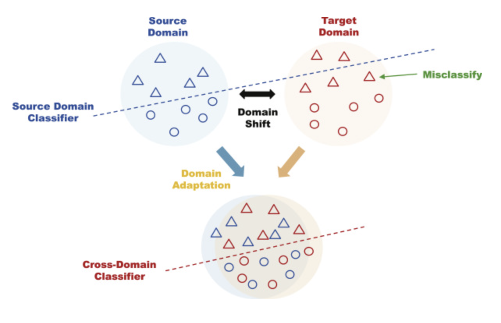
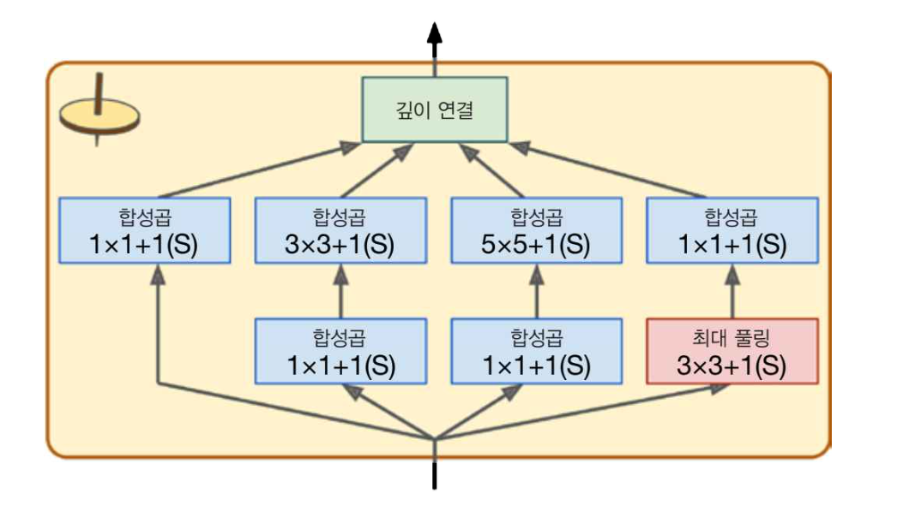
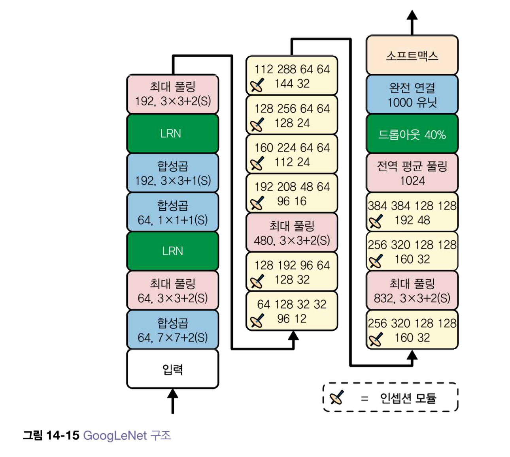
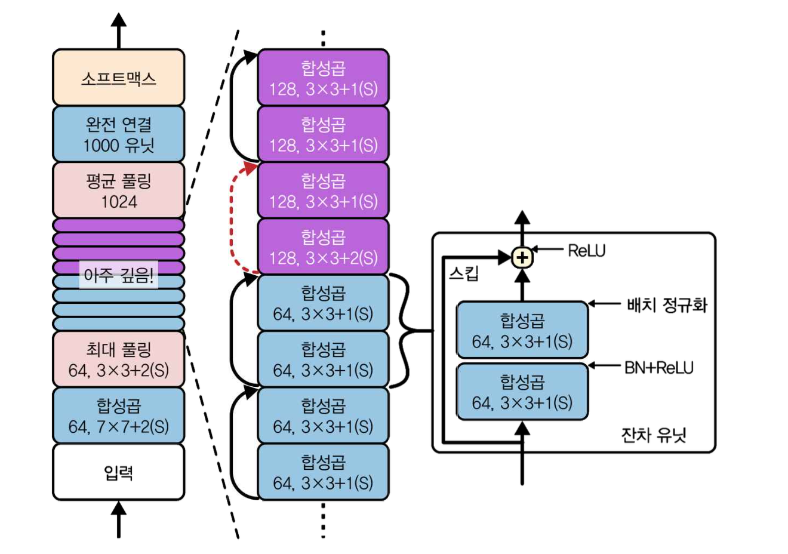
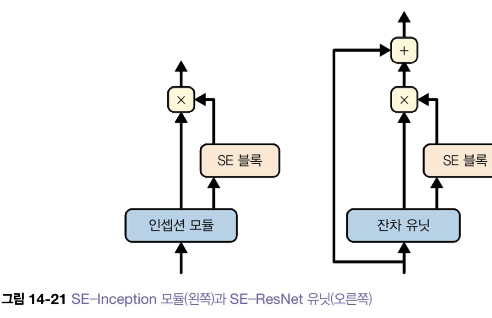

## learning-AI : deep learning application (61357002)
### topic 4 : transfer learning과 variant CNN

<br>

- **임규연 (lky473736)**
- 2024.09.26.

------

### gradient exploding
```
 그레이디언트 소실(gradient vanishing)이라고 합니다. 반면, 경우에 따라서는 그레이디언트가 점점 커져 여러 층에서 비정상적으로 큰 가중치가 갱신되어 알고리즘이 발산하게 되는 현상도 발생할 수 있습니다. 이를 그레이디언트 폭발(gradient exploding)이라고 부르며, 순환 신경망(RNN)에서 주로 나타나는 문제입니다. 일반적으로 불안정한 그레이디언트는 심층 신경망의 훈련을 어렵게 만들며, 각 층마다 학습 속도가 다르게 변할 수 있습니다.
```

- gradient descendant는 기울기가 소실되고 있는 상태이지만, 기울기가 폭발적으로 증가할 수도 있다.
    - ex) LSTM에서 optimizer를 relu를 사용하면 기울기 폭발 가능성 있음 (그래서 tanh를 쓰는 것)
- **gradient clap**을 이용하여 해결 가능

<br>

### transfer learning
- **Reference**
    - https://github.com/MyungKyuYi/AI-class/blob/main/Pre-trained_model.ipynb
    - https://lhw0772.medium.com/study-da-domain-adaptation-%EC%95%8C%EC%95%84%EB%B3%B4%EA%B8%B0-%EA%B8%B0%EB%B3%B8%ED%8E%B8-4af4ab63f871
    - https://2bdbest-ds.tistory.com/entry/%EB%85%BC%EB%AC%B8-%EB%A6%AC%EB%B7%B0-Domain-Adaptation



- 만약에 오른쪽 팔에 대한 정보를 학습한 모델에 왼쪽 팔에 대한 정보를 input하고 prediction하라고 하면 acc가 좋지 않을 것이다. 
    - **하지만 오른쪽 팔과 왼쪽 팔은 전체적인 domain subject가 비슷하다**
    - domain adaptation을 하기 위해, 즉 오른쪽 팔을 학습한 모델을 왼쪽 팔에도 적합하도록 구성하기 위해 **transfer learning**을 하자는 것이다.
```
사전 학습과 미세 조정
전이 학습을 하기 위해서는 학습된 모델과 새로 학습할 데이터셋이 필요합니다. 여기서 학습된 모델을 만드는 과정을 사전 학습(pre-training)이라고 합니다. 미세 조정(fine-tuning)은 사전 학습된 모델을 새로운 문제에 적용하기 위해 일부 가중치를 조절하는 학습 과정을 말합니다.

참고로, 전이 학습과 미세 조정을 헷갈릴 수 있는데, 전이 학습은 모델을 효율적으로 학습하기 위한 하나의 큰 접근 방법이며, 미세 조정은 전이 학습에서 사용되는 기법 중 하나라고 볼 수 있겠습니다.
```

- 사전 학습의 장점, 특징
    - 이전 모델 (pre-trained model) 에서 학습된 가중치랑 bias를 전부 저장하는 것이기 때문에, 이전 모델을 다시 학습할 필요 없이 현재 문제를 해결할 수 있다 -> 시간이 절약된다
    - 이미 잘 만들어진 모델에다가 현재 문제에 맞는 layer를 추가하면 성능이 올라갈 것이다.
    - 작은 데이터셋에 대해 학습할 때 오버피팅을 예방할 수 있다
        - 적은 데이터로 특징을 추출하기 위한 학습을 하게 되면, 데이터 수에 비해 모델의 가중치 수가 많을 수 있어 미세한 특징까지 모두 학습할 수 있음
        - 전이 학습을 이용해 마지막 레이어만 학습하게 한다면, 학습할 가중치 수가 줄어 과한 학습이 이루어지지 않게 할 수 있음.
    - pre-trained model에서의 input_shape와 현재 문제에서 사용할 데이터셋의 input_shape가 같아야 하기 때문에 reshape해주어야 함

- 예시 : MNIST 데이터셋
```python
import tensorflow as tf
from tensorflow.keras import layers, models
from tensorflow.keras.datasets import mnist
from tensorflow.keras.utils import to_categorical

# MNIST 데이터셋 불러오기
(train_images, train_labels), (test_images, test_labels) = mnist.load_data()

# 데이터 전처리 (정규화 및 차원 추가)
train_images = train_images.reshape((60000, 28, 28, 1)).astype('float32') / 255
test_images = test_images.reshape((10000, 28, 28, 1)).astype('float32') / 255

# 레이블을 one-hot 인코딩
train_labels = to_categorical(train_labels)
test_labels = to_categorical(test_labels)

# 모델 정의
model = models.Sequential()

# CNN 레이어
model.add(layers.Conv2D(32, (3, 3), activation='relu', input_shape=(28, 28, 1)))
model.add(layers.MaxPooling2D((2, 2)))
model.add(layers.Conv2D(64, (3, 3), activation='relu'))
model.add(layers.MaxPooling2D((2, 2)))
model.add(layers.Conv2D(64, (3, 3), activation='relu'))

# 완전연결(Dense) 레이어
model.add(layers.Flatten())
model.add(layers.Dense(64, activation='relu'))
model.add(layers.Dense(10, activation='softmax'))  # 10개의 클래스 (0~9)

# 모델 컴파일
model.compile(optimizer='adam',
              loss='categorical_crossentropy',
              metrics=['accuracy'])

# 모델 학습
model.fit(train_images, train_labels, epochs=5, batch_size=64, validation_split=0.1)

# 모델 평가
test_loss, test_acc = model.evaluate(test_images, test_labels)
print(f'Test accuracy: {test_acc}')

```

```python
import tensorflow as tf
from tensorflow.keras.applications import VGG16
from tensorflow.keras import layers, models
from tensorflow.keras.datasets import mnist
from tensorflow.keras.utils import to_categorical
import numpy as np

# MNIST 데이터셋 불러오기
(train_images, train_labels), (test_images, test_labels) = mnist.load_data()

# VGG16은 224x224 크기의 입력을 기대하므로 MNIST 데이터를 리사이징
train_images = np.stack([np.stack([np.pad(image, ((98, 98), (98, 98)), mode='constant') for image in train_images], axis=0)], axis=-1).squeeze()
test_images = np.stack([np.stack([np.pad(image, ((98, 98), (98, 98)), mode='constant') for image in test_images], axis=0)], axis=-1).squeeze()

# 이미지 데이터를 float로 변환하고 정규화
train_images = train_images.astype('float32') / 255
test_images = test_images.astype('float32') / 255

# 레이블을 one-hot 인코딩
train_labels = to_categorical(train_labels)
test_labels = to_categorical(test_labels)

# VGG16 사전학습 모델 불러오기, 출력층 제외 (include_top=False)
vgg_base = VGG16(weights='imagenet', include_top=False, input_shape=(224, 224, 3))

# VGG16의 가중치는 학습하지 않도록 고정
vgg_base.trainable = False

# 전이 학습 모델 정의
model = models.Sequential()

# VGG16 모델 추가
model.add(vgg_base)

# CNN에 적합한 Fully Connected Layer 추가
model.add(layers.Flatten())
model.add(layers.Dense(256, activation='relu'))
model.add(layers.Dropout(0.5))
model.add(layers.Dense(10, activation='softmax'))  # 10개의 클래스 (0~9)

# 모델 컴파일
model.compile(optimizer='adam',
              loss='categorical_crossentropy',
              metrics=['accuracy'])

# 모델 학습
model.fit(train_images, train_labels, epochs=5, batch_size=64, validation_split=0.1)

# 모델 평가
test_loss, test_acc = model.evaluate(test_images, test_labels)
print(f'Test accuracy: {test_acc}')

```

```python
# VGG16의 가중치 학습을 True로 변경
vgg_base.trainable = True

# 전이 학습 모델 정의
model = models.Sequential()

# VGG16 모델 추가
model.add(vgg_base)

# CNN에 적합한 Fully Connected Layer 추가
model.add(layers.Flatten())
model.add(layers.Dense(256, activation='relu'))
model.add(layers.Dropout(0.5))
model.add(layers.Dense(10, activation='softmax'))  # 10개의 클래스 (0~9)

# 모델 컴파일
model.compile(optimizer='adam',
              loss='categorical_crossentropy',
              metrics=['accuracy'])

# 모델 학습
model.fit(train_images, train_labels, epochs=5, batch_size=64, validation_split=0.1)

# 모델 평가
test_loss, test_acc = model.evaluate(test_images, test_labels)
print(f'Test accuracy: {test_acc}')
```

- fine-tuning
    - trainable를 False로 두었었는데, 다시 True로 바꾸어서 학습을 진행함
    - 그러면 어차피 다시 학습을 진행할 건데 굳이 왜 다시 학습?
        - 맨 처음에 가중치랑 절편은 random값이여서 처음부터 쭉 학습하는 것보다는, **이미 정답에 가까운 가중치와 절편을 이용하여 조금만 변경하는 것이 훨씬 더 빠르고 정확도 높다**
        - initialization point

- 결론 
    - trainble을 False로 두고 현재 문제에 맞춰서 layer를 추가한다 -> pre-trained model
    - trainable를 다시 True로 두고 학습을 진행한다 -> fine-tuning

- 참고 : 정규화 방식
    - model 안에서의 정규화 : BatchNormalization layer
    - model 밖에서의 정규화 : MinMaxScaler, StandardScaler...

### embedding

- encoding의 종류
    - label encoding
    - onehot encoding
    - **text embedding**
- text embedding
    - ``` this is the news```와 같은 문장에서 단어를 mapping하는 것임 (this는 0, is는 1 ... / 딕셔너리가 필요함)
    - 가장 많이 사용하는 단어는 조사 (관사, a, the ...)
    -  https://aws.amazon.com/ko/what-is/embeddings-in-machine-learning/
    - text embedding을 layer로도 할 수도 있고, 아니면 딕셔너리로도 할 수도 있고
    - euclidean distance를 구해서 가까운  것으로 embedding
- contrast learning
- LLM에서 가장 많이 사용하는 것은 당연히 **transfer learning** -> 좋은 LLM 모델을 앞에 base model로 두어서 모델링하는 것 (BERT, llama...)

###

### Variant CNN

- LeNet-5 
    - 이때의 activation은 전부 tanh
- AlexNet 
    - relu activation 도입
    - softmax 도입
    - LRN
- GoogLeNet (inception model)
    - 아래 figure가 inception 하나에 해당되는 것임
        - 
    - 여러 크기의 특성맵을 출력하는 합성곱 층을 구성
    - ```
        1x1 커널의 합성곱 층은 인셉션 모듈에서 중요한 역할을 합니다. 겉보기에는 한 번에 하나의 픽셀만 처리하기 때문에 공간적인 패턴을 잡지 못할 것처럼 보일 수 있지만, 실제로는 세 가지 주요 목적을 가지고 있습니다:

        1. **깊이 차원의 패턴 감지**: 1x1 합성곱층은 공간상의 패턴을 잡을 수 없지만, 채널(깊이) 차원을 따라 놓인 패턴을 잡을 수 있습니다. 즉, 채널 간 상관관계를 학습하는 데 유용합니다.

        2. **차원 축소**: 이 층은 입력보다 더 적은 특성 맵을 출력하므로, 병목층(bottleneck layer) 역할을 합니다. 차원을 줄이는 동시에 연산 비용과 파라미터 개수를 줄여 훈련 속도를 높이고, 과적합을 줄여 일반화 성능을 향상시키는 데 기여합니다.

        3. **복잡한 패턴 감지**: 1x1 합성곱층은 더 복잡한 패턴을 감지하기 위한 도구로 사용됩니다. 1x1 합성곱층과 3x3 또는 5x5 합성곱층의 쌍은 더 복잡한 패턴을 감지할 수 있는 하나의 강력한 합성곱층처럼 작동합니다. 이는 두 개의 층을 가진 신경망이 이미지를 훑는 것과 같은 방식으로, 더욱 정교한 특성을 학습할 수 있게 해줍니다.

        따라서, 1x1 합성곱층은 단순해 보일 수 있지만, 깊이 차원의 패턴을 감지하고, 차원을 축소하며, 더 복잡한 패턴을 감지하는 데 중요한 역할을 합니다.
        ```
    - 
    - 이전에 나온 inception 모듈이 팽이 모양

- VGGNet 
- ResNet
    - 
    - 목적
        - 잔차 학습을 도입하여 학습 용이하게 함
        - gradient vanishing problem 해결 위해
- Xception
    - Reference
        - https://wikidocs.net/164801

    - GoogLeNet + 깊이별 분리 합성곱층
    - ```Inception-v4는 GoogLeNet과 ResNet의 아이디어를 결합하여 설계된 모델입니다. 이 모델에서 인셉션 모듈은 **깊이별 분리 합성곱층(depthwise separable convolution)**을 도입하여 연산 효율성을 극대화하고 성능을 향상시키는 데 기여합니다.

        **깊이별 분리 합성곱층(depthwise separable convolution)**이란, 일반 합성곱 연산을 두 단계로 나누는 방식을 의미합니다:
        1. **Depthwise Convolution**: 채널별로 개별적인 합성곱을 적용하여 공간 차원에서 패턴을 감지합니다.
        2. **Pointwise Convolution (1x1 Convolution)**: 1x1 합성곱을 사용하여 채널 간의 상호작용을 학습합니다.

        이 방식을 통해 **연산량을 줄이고** **모델의 효율성을 극대화**할 수 있습니다. 즉, 더 적은 계산으로도 복잡한 패턴을 감지할 수 있게 됩니다. 이러한 구조는 ResNet의 잔차 연결(residual connections)과 인셉션 모듈의 특징을 결합하여 **성능과 효율성**을 모두 강화시킨 모델입니다.

        Inception-v4에서도 이러한 분리 합성곱층을 사용하여 더 나은 성능을 달성하며, 동시에 모델의 복잡도를 조절하고 연산 비용을 줄일 수 있습니다.
        ```
    - 여기에서도 1 by 1 깊이 필터를 사용한 conv layer로 구성된다. (GoogLeNet 설명 참고)

- SENet


- DenseNet
    - https://velog.io/@lighthouse97/DenseNet%EC%9D%98-%EC%9D%B4%ED%95%B4
    - 


1. 만약에 tree방식에서(random forest) 둘이 correlence가 비슷한 features를 동시에 넣는 것이 더 좋다 (curse of dimensionality의 초월)
2. regression은 features가 둘이 비슷하면 하나만 넣는게 낫다
