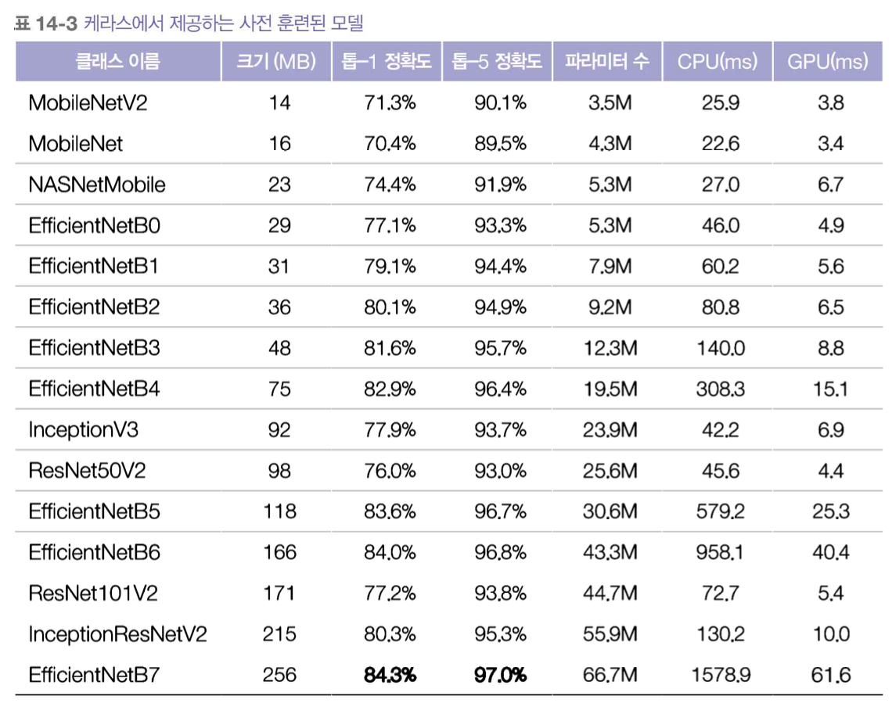
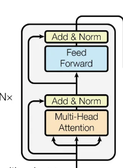
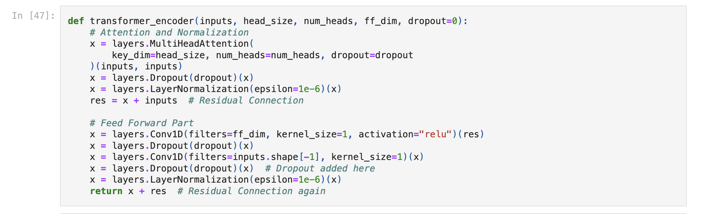

## learning-AI  : deep learning application (61357002)
### topic 6 

<br>

- **임규연 (lky473736)**
- 2024.10.10.

------

### 이전 시간 복습
- **사전 학습 모델 (pre-trained model)**
    - 가장 큰 목적 : 전문가가 잘 만들어놓은 모델을 가져오자 
    - 근데 기존 모델을 가져와서 또 학습시키기엔 파라미터가 많아지니 학습 시간이 많아짐
        - -> **따라서 trainable를 False로 둠 (freezing)**

- **fine-tuning**
    - 다시 trainable를 True로 둠
    - 그러면 어차피 다시 학습을 진행할 건데 굳이 왜 다시 학습?
        - 맨 처음에 가중치랑 절편은 random값이여서 처음부터 쭉 학습하는 것보다는, **이미 정답에 가까운 가중치와 절편을 이용하여 조금만 변경하는 것이 훨씬 더 빠르고 정확도 높다** (domain이 비슷하면)
        - initialization point

- **PCA vs AE (auto-encoder)**
    - 입력과 출력이 유사하게 되도록 
    - 둘 다 encoder임 -> 결국엔 encoder로 latent space를 만들고 DNN 붙여서 출력해낼 수 있음
    - **dimensionality reduction**
        - **PCA** : 주성분 분석, eigenvalue를 이용하여 축소시킴 (PCA 전과 PCA 후를 비교하였을 때 무조건 PCA하여서 성능이 좋지 않을 수 있다)
        - **AE** : encoder-decoder 방식 
            - 입력 $x$ -> encoder로 latent space를 만듦 (**데이터를 압축한 버전**)
            - -> latent space를 보고 decoder로 다시 복호화 -> 출력 $x hat$
            - **reconstruction error** : $x hat - x$
            - 만약에 강아지 사진으로 AE를 학습시켰을 때 고양이 사진이 들어오면 이상치라고 반응 -> AE로 **anomaly detection**할 수 있게 됨
                - 차이가 크다 -> 에러가 난다 
                - MSE, MAE를 reconstruction error로 많이 사용 
            - encoder가 제일 중요함 (latent space를 만드는게 목적이니깐)

- **transformer** 
        - self-attention
        - multi-head attention
        - embedding
        - positional embedding
    - **self-attention** : 필요한 정보에만 집중
        - 데이터가 굉장히 많이 나올 때, 어느 부분을 집중할 것인가? 
            - 나는 오늘 밥을 먹었어 <- 여기서 **먹었어**가 가장 중요함
            - 동요 **반달**을 각각 translator와 gpt를 이용하여 번역
                - google : Blue sky, Milky Way, white boat, one cinnamon tree, one rabbit
                - gpt : "Blue sky, Milky Way, on the white little boat One laurel tree, one rabbit."
                - **gpt가 더 문맥을 잘 받아들임**
                    - parameter가 더 많음
                    - self-attention. white little boat라고 하는 것에 중점을 두어서 해석함 (**attention score**)
    - **multi-head attention** : 병렬적으로 attention score을 동시에 구하자
    - **embedding** : 단어를 고차원 벡터로 변환해, 단어들 간의 관계를 학습
        - 예시 : "사과"는 [0.2, 0.7], "바나나"는 [0.3, 0.8] 같은 벡터로 변환되어, 단어들 간의 유사성을 학습
    - **positional embedding**
        - Transformer는 데이터의 순서를 고려하지 않기 때문에, 각 단어의 위치 정보를 포함한 **positional encoding**을 추가해 순서를 학습함
        - **예시** : "나 너 돈줘"와 "너 나 돈줘"는 단어 순서만 다르지만 의미가 달라지므로, 위치 정보를 포함해 이를 학습.

### Variant CNN
- 결국엔 **Attention**이 제일 중요. 모든 정보가 중요한 것이 아니다. parameter를 어떻게 해서 경량화할 것인가? (아래 순서대로 attention이 발전하였고, 결국엔 **attention**이 등장하게 된 것이다)

- **ResNet**
    - skip-connection
        - 신경망이 길어지면 gradient vanishing problem이 발생 -> skip-connection을 이용하여 F(x) + x 연산을 도입

- **GoogleNet**
    - inception
    - 1x1 커널을 사용하는 이유
    -
            1x1 커널의 합성곱 층은 인셉션 모듈에서 중요한 역할을 합니다. 겉보기에는 한 번에 하나의 픽셀만 처리하기 때문에 공간적인 패턴을 잡지 못할 것처럼 보일 수 있지만, 실제로는 세 가지 주요 목적을 가지고 있습니다:

            1. **깊이 차원의 패턴 감지**: 1x1 합성곱층은 공간상의 패턴을 잡을 수 없지만, 채널(깊이) 차원을 따라 놓인 패턴을 잡을 수 있습니다. 즉, 채널 간 상관관계를 학습하는 데 유용합니다.

            2. **차원 축소**: 이 층은 입력보다 더 적은 특성 맵을 출력하므로, 병목층(bottleneck layer) 역할을 합니다. 차원을 줄이는 동시에 연산 비용과 파라미터 개수를 줄여 훈련 속도를 높이고, 과적합을 줄여 일반화 성능을 향상시키는 데 기여합니다.

            3. **복잡한 패턴 감지**: 1x1 합성곱층은 더 복잡한 패턴을 감지하기 위한 도구로 사용됩니다. 1x1 합성곱층과 3x3 또는 5x5 합성곱층의 쌍은 더 복잡한 패턴을 감지할 수 있는 하나의 강력한 합성곱층처럼 작동합니다. 이는 두 개의 층을 가진 신경망이 이미지를 훑는 것과 같은 방식으로, 더욱 정교한 특성을 학습할 수 있게 해줍니다.

            따라서, 1x1 합성곱층은 단순해 보일 수 있지만, 깊이 차원의 패턴을 감지하고, 차원을 축소하며, 더 복잡한 패턴을 감지하는 데 중요한 역할을 합니다.

- **SENet (Squeeze and excitation)**


    - **과연 모든 채널과 모든 정보가 중요할까?**
    - 중요한 정보가 담긴 채널에만 집중해야 하며, 나머지는 무시해야함
        - -> 채널에 대한 중요도를 매기고, 중요한 정보만 get하자
        - 정보의 추출은 pooling으로 함 
            - 그래서 여기 소스에서 **GlobalAveragePooling을 사용하여 채널 간 상호작용으로 가장 중요한 특성을 뽑아낸 것임** (https://github.com/lky473736/learning-AI/blob/main/report/PAMAP/SENet(non-recurrence)_classification_PAMAP.ipynb)
            - ```python
                # SE block 정의 (GlobalAveragePooling을 사용하여 채널 간 상호작용으로 가장 중요한 특성을 뽑아냄)

                def se_block(input_tensor, ratio=16):
                    filters = input_tensor.shape[-1]
                    
                    se = GlobalAveragePooling1D()(input_tensor)
                    se = Reshape((1, filters))(se)
                    se = Dense(filters // ratio, activation='relu')(se)
                    se = Dense(filters, activation='sigmoid')(se)
                    se = Multiply()([input_tensor, se])
                    return se 
            - CNN보다 훨씬 lightweight하게 학습할 수 있다 (depth-wise seperator convolution)
                - **Depthwise Separable Convolution**

                    Step 1: Depthwise Convolution
                    Convolution에서는 모든 입력 채널을 고려하여 하나의 필터를 적용하지만, 
                    Depthwise Convolution에서는 각 채널마다 별도의 필터를 사용. 
                    이로 인해 채널 간의 상호작용은 고려되지 않고 각 채널은 독립적으로 처리

                    Step 2: Pointwise Convolution
                    Depthwise Convolution을 통해 각 채널별로 처리된 출력을 다시 결합하기 위해 1x1 Convolution을 적용
                    이 과정에서 채널 간의 상호작용을 고려하며, Depthwise Convolution으로 축소된 연산 비용을 보충
                - **Xception (depth-wise와 반대)**
                    
                    Xception에는 Step 2 이후 Step 1을 수행

                    원래 Inception 모듈에서는 첫 번째 연산 후 비선형성이 있으나,
                    수정된 깊이별 분리형 합성곱인 Xception에서는 중간 ReLU 비선형성이 없음
    - 
- DenseNet
    - 
    - **Skip-connection이 full-connected되었다**
        - lightweight하지는 않지만 풍부한 학습이 가능해질 것임

- 요즘 트렌드는 **parameter가 적으면서도, 성능이 좋은 것**
    - 웨어러블 기기가 많이 등장 -> 그 작은 기기에 ai를 넣기 위해선 parameter를 줄이면서 성능을 높여야 함
    - 

### transformer-encoder 실습
- encoder 구현
    - 이 그림을 아래 코드로 구현
        - 
    - 
- encoder 뒤에 dense로 구현