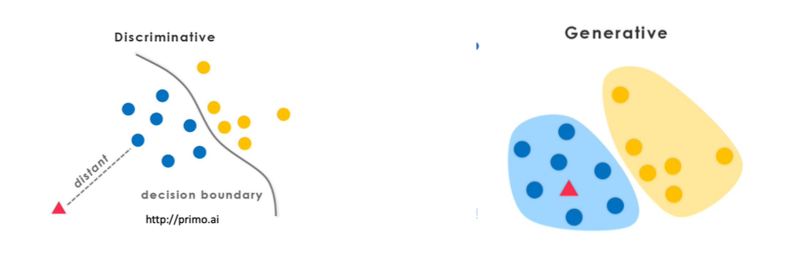
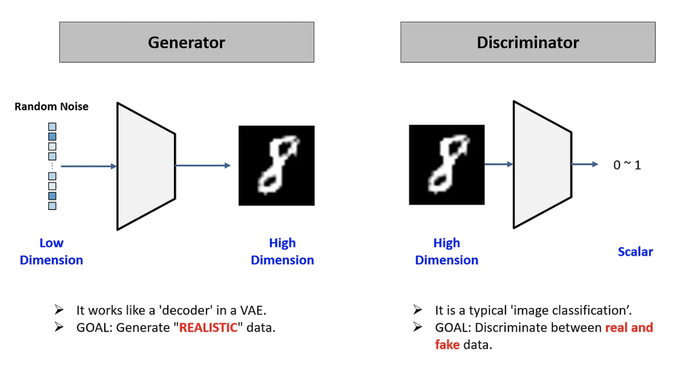
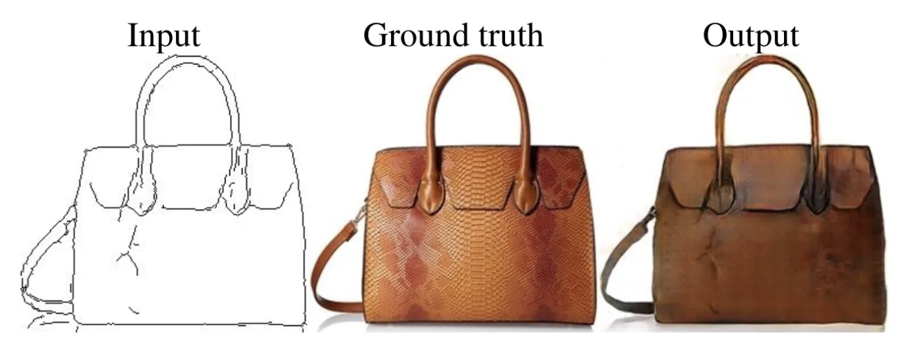

## learning-AI  : deep learning application (61357002)
### topic 10

 

- **임규연 (lky473736)**
- 2024.11.07.

------

### 복습

- latent space : encoder로 인하여 **압축**된 정보
    - representation learning?
        - https://89douner.tistory.com/339
    - swiss roll
        - manifold learning (가설임)
        - 적어도 차원을 조금 줄여서 f(x)를 계산하기 쉽게 하자
    - 고차원의 데이터를 저차원으로 표현하는 것 (**압축**) == 잠재 공간으로 새로운 형태를 만들 수도 있다 == latent vector를 구하는 이유 
- 딥러닝을 확률적으로 해석하면
    - 출력 데이터로부터 원본 데이터의 확률분포를 예측할 수 있다 (P(X|Y))
    - likelihood : 가능도, 주어진 관측값이 특정 확률분포로부터 나왔을 확률 (= 연속확률밀도함수의 y 값)
    - 결국에는 P(data | distribution)
    - MLE == Maximum Likelihood == 주어진 확률분포에 대하여 가장 최적의 값을 찾자
    - **입력 데이터로부터 확률분포를 예측하자**
    - 그니깐, 원래 정규분포부터 얼마나 유사한 분포를 찾는 과정이, 기존 실제 데이터와 예측값이 얼마나 acc이 높는가를 찾는 것임 (근삿값을 찾는 것)
    - 과정
        - (1) 입력 데이터의 일부를 sampling하여 그것의 표준편차와 평균을 구한다
        - (2) 그걸 가지고서 변분추론을 하자는 것 (variational inference == 근삿값을 찾자)
        - (3) 가깝게 weight와 bias를 조정하자
- AE 정리
    - AE의 목적 : 정보의 압축 
        - PCA의 목적 : 정보의 압축, 차원의 축소
        - 정보의 압축의 이유 : 차원을 줄이면 학습하기 좋다
        - feature selection과 압축은 목적은 똑같지만, 방법은 다르다 (당연한 것임)
    - VAE의 목적 : latent space로부터 원본 데이터와 유사한 걸 만들자 (정보 생성)
        - 정보를 생성하기 위해서 latent space를 만드는 것임 (latent space == latent vector 여러 개)
        - 막연히 하기 어려우니 기존의 데이터의 분포를 얻어서 VAE를 돌리자

### GAN

- https://github.com/MyungKyuYi/AI-class/blob/main/GAN.md
- GAN, VAE의 목적 : 원본 데이터로부터 새로운 데이터의 생성
    - 코의 길이, 눈의 모양 등의 다변수 확률분포를 찾아서 새로운 걸 만들자 (결국에 아래 사진에서 generative가 **확률분포를 찾는다는 것**)
        - 
    - 기존 확률분포와 생성된 확률분포를 가능하면 비슷하게 하자
        - 결국에 모델은 **분포**를 학습하는 것
        - 실제 분포와 노이즈 분포를 계속 학습하면서 실제와 비슷하게 하자
- 아래는 GAN의 component structure
    - 
    - generator : noise를 진짜처럼
    - discriminator : 실제 이미지, 가짜 이미지를 구별
- mode collapse
    - 반대로 Generator가 지나치게 잘 학습되면, Discriminator가 생성된 이미지를 효과적으로 구분하지 못하게 되고, Generator는 특정한 종류의 이미지만 계속 생성하게 됨
        - 사과와 자두
    - 원인 1) gradient vanishing problem
    - 원인 2) data의 bias 
    - 원인 3) 너무 민감함

### GAN의 변형
- **Reference**
    - https://medium.com/@hugmanskj/gan%EC%9D%98-%EB%B3%80%ED%98%95%EB%93%A4-cgan-pix2pix-cyclegan-pix2pix-09a7a5a23002
- vanilla GAN
    - dense layer로만 만들어짐. 이러면 mode collapse
- DCGAN 
    - dense layer를 Convolution layer로 (mode collapse 해결하기 위해)
- CGAN
    - GAN은 unsupervised. 따라서 조건을 주어서 학습할 수 있다
    - generator : 랜덤 노이즈랑 조건 정보를 입력받아 이미지 생성
    - discriminator : 원래랑 동일
- Fix2Fix
    - 
    - input과 ground truth로 output을 만드는 것임
- CycleGAN

### GAN 구현

- 이차함수 : https://machinelearningmastery.com/how-to-develop-a-generative-adversarial-network-for-a-1-dimensional-function-from-scratch-in-keras/
- MNIST : https://machinelearningmastery.com/how-to-develop-a-generative-adversarial-network-for-an-mnist-handwritten-digits-from-scratch-in-keras/

### diffusion model

- 원본 데이터를 노이즈를 추가하여 잘 안보이게 함
    - **반대로 하면? (역단계)**
    - 결국에 역과정을 학습하여 새로운 데이터를 생성하게 함
    - https://ffighting.net/deep-learning-paper-review/diffusion-model/diffusion-model-basic/
