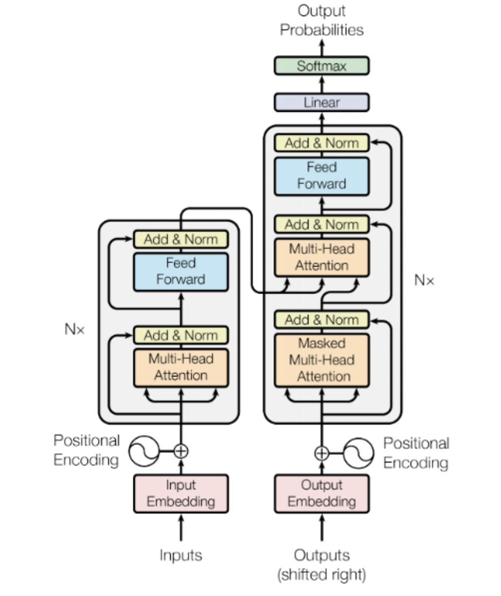
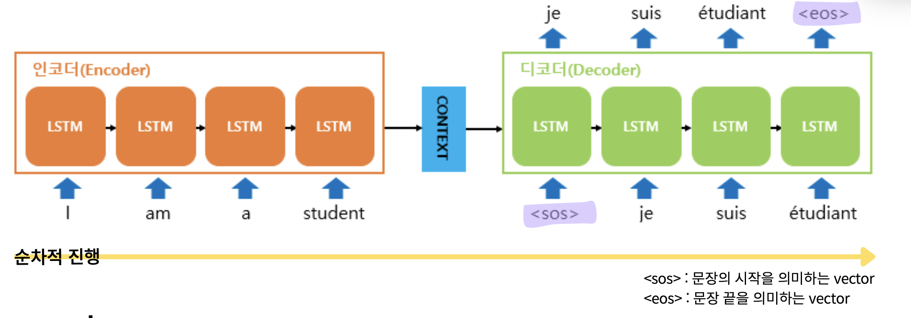
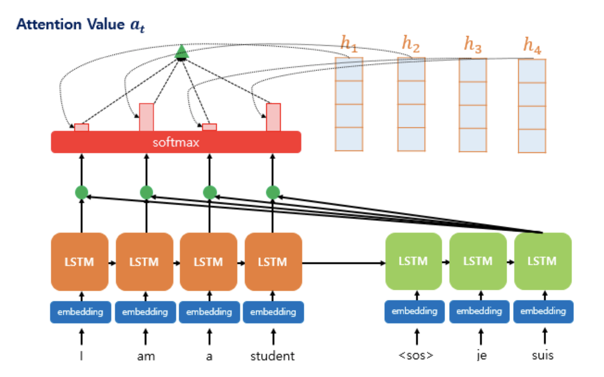
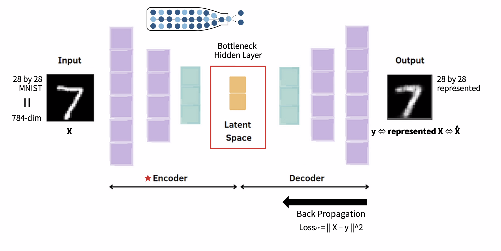
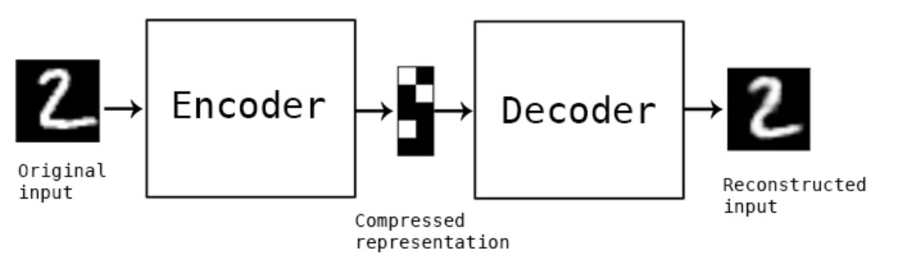

## learning-AI  : deep learning application (61357002)
### topic 5  : transformer, autoencoder, U-net

 

- **임규연 (lky473736)**
- 2024.10.03

------

### Transformer

- **"Attention is all you need"**
    - Transformer는 RNN과 LSTM의 순차적인 데이터 처리 방식을 벗어나, **병렬적으로** 데이터를 처리함. attention 메커니즘을 통해 중요한 정보에 집중하고 덜 중요한 정보를 무시하며, 여러 데이터의 상관관계를 학습.
    - **예시** : "오늘은 날씨가 매우 좋다"라는 문장에서 "오늘"과 "날씨", "좋다" 사이의 관계를 파악해, 중요한 단어들의 상호관계를 학습. 이 과정에서 각 단어들이 서로에게 얼마나 중요한지 계산.

- **RNN과 LSTM의 Review**
    - **RNN** : 이전 상태의 정보를 다음 상태로 전달하는 순환 신경망. 하지만 **Gradient vanishing**(기울기 소실) 문제로 긴 문장의 정보가 제대로 전달되지 않음.
        - **예시** : 긴 문장에서 앞쪽의 단어들이 학습 과정에서 소실되어, "사과는 맛있는 과일이다" 같은 문장에서 "사과"와 "과일" 간의 관계를 학습하는 데 어려움이 발생.
    - **LSTM** : RNN의 단점을 보완하기 위해 **Cell state**를 도입, 중요한 정보를 오랜 시간 기억하고 불필요한 정보를 잊어버리게 설계.
        - **예시** : "내일은 비가 올 것이다"라는 문장에서, LSTM은 "내일"과 "비"의 관계를 기억하면서 "올 것이다" 같은 덜 중요한 정보는 적절히 필터링.
    - **문제점** : RNN과 LSTM 모두 입력과 출력의 길이가 고정되어 있기 때문에, 입력과 출력 길이가 유동적인 경우 (예 : 번역 작업)에는 적합하지 않음. 이 문제를 해결하기 위해 나온 것이 **seq2seq** 모델.

- **seq2seq**
    - **Sequence-to-sequence 모델**은 입력 sequence를 인코더로 처리하여, 이를 **context vector**로 변환한 후, 디코더에서 이를 바탕으로 새로운 sequence를 생성함.
    - **예시** : 번역 작업에서 "I love apples"라는 문장을 입력하면, 인코더가 이 문장을 벡터로 압축하고, 디코더가 이를 기반으로 "나는 사과를 좋아한다"라는 한국어 문장을 생성함.
    - 이 과정에서 모든 입력 데이터가 **context vector**라는 하나의 벡터로 변환되기 때문에, 긴 문장은 정보가 압축되어 중요한 정보가 손실될 수 있음.

- **Context Vector**
    - 인코더가 입력 데이터를 요약한 벡터로, 디코더는 이를 이용해 출력 sequence를 생성. 하지만 긴 문장의 경우 정보가 과도하게 압축되어 성능 저하 발생.

- **Attention vs Transformer**
    - **Attention** : 문장의 각 단어가 다른 단어들과 얼마나 연관성이 있는지를 계산해, 중요한 정보를 선택적으로 학습함. 순차적으로 데이터를 처리하기 때문에 연산이 느림.
        - https://modulabs.co.kr/blog/introducing-attention/
        - **예시** : "사과는 맛있다"에서 "사과"와 "맛있다"의 관계를 집중적으로 학습.
    - **Transformer** : attention 메커니즘을 개선해 모든 단어를 동시에 처리. 연산 속도가 빠르고, 각 단어의 위치 정보를 고려하기 위해 **positional encoding**을 사용.
        - **예시** : "나는 책을 읽는다"와 "책을 나는 읽는다" 같은 문장에서 단어 순서가 바뀌더라도, 의미를 고려해 적절히 처리.

- **Embedding**
    - 단어를 고차원 벡터로 변환해, 단어들 간의 관계를 학습하는 단계.
    - **예시** : "사과"는 [0.2, 0.7], "바나나"는 [0.3, 0.8] 같은 벡터로 변환되어, 단어들 간의 유사성을 학습.

- **Positional Embedding**
    - Transformer는 데이터의 순서를 고려하지 않기 때문에, 각 단어의 위치 정보를 포함한 **positional encoding**을 추가해 순서를 학습함.
    - **예시** : "나 너 돈줘"와 "너 나 돈줘"는 단어 순서만 다르지만 의미가 달라지므로, 위치 정보를 포함해 이를 학습.

- **Transformer의 핵심 요소**
    - **Embedding** : 단어를 숫자로 변환하여 고차원 벡터로 표현.
    - **Positional Embedding** : 단어의 위치 정보를 포함해 문장의 순서를 고려.
    - **Multi-head Attention** : 여러 개의 attention layer를 통해 문장의 상호관계를 여러 관점에서 동시에 학습.
    - **Transformer** : 병렬 처리로 빠르게 학습하며, attention을 통해 중요한 정보를 학습.

---

### AutoEncoder

- https://keraskorea.github.io/posts/2018-10-23-keras_autoencoder/
- 기존 MLP 방식과 달리 인코더-디코더 구조를 가짐. 인코더는 데이터를 압축하여 **latent vector**를 생성하고, 디코더는 이를 다시 복원.
- **Structure**
    - 인코더는 입력 데이터를 점차 축소해 핵심 정보를 추출하고, 디코더는 이를 바탕으로 데이터를 복원.
    - **예시** : 64x64 이미지가 인코더에서 32x32로 압축되고, 디코더에서 다시 64x64로 복원됨.
- **Self-supervised Learning** : 레이블이 없는 데이터를 사용하여 학습. 입력 데이터 자체를 복원하는 과정을 통해 모델이 학습됨.
    - **예시** : 손상된 이미지에서 원본 이미지를 복원하거나, 노이즈가 추가된 데이터에서 원래 데이터를 복원.
- **Latent Vector (Latent Space)** : 인코더가 생성한 **압축된 표현**으로, 중요한 정보만을 담고 있음.
    - **예시** : 원래의 고차원 데이터를 저차원 공간에 투영하여, 중요한 정보는 유지하면서 데이터 양을 줄임.
- **Reconstruction Error** : 입력 데이터와 복원된 데이터 간의 차이. 이 차이가 클수록 모델이 데이터를 잘 복원하지 못한 것.
    - **예시** : 손상된 이미지에서 원본과 복원된 이미지의 차이를 계산하여 reconstruction error를 평가.
- **Anomaly Detection** : 정상적인 데이터를 학습한 후, 이상 데이터를 복원하지 못해 높은 reconstruction error가 발생하는 것을 기반으로 이상치를 탐지.
    - **예시** : 신용카드 거래에서 정상 거래는 잘 복원되지만, 이상 거래는 복원 오차가 크게 발생하여 이를 탐지.
- **Manifold Learning** : 고차원 데이터를 저차원 공간으로 표현하여 중요한 특징을 학습하는 방식.

---

### U-Net

 

- **U-Net**은 주로 **이미지 분할**에 특화된 CNN 구조. 의료 영상 분석을 포함해 다양한 이미지 분할 작업에 활용됨.
- **Structure**
    - U자형 구조를 가지며, 좌측은 **인코더**(down-sampling), 우측은 **디코더**(up-sampling)로 이루어짐. 인코더는 입력 이미지를 점차 축소하여 중요한 특징을 추출하고, 디코더는 이를 다시 원래 크기로 복원.
    - **예시** : 512x512 크기의 의료 이미지를 입력받아, 인코더가 이를 256x256, 128x128 등으로 축소한 뒤, 디코더가 이를 다시 512x512로 복원하며, 각 픽셀의 클래스를 예측.
- **Skip Connection**
    - U-Net의 핵심은 인코더에서 추출한 특징 정보를 디코더로 직접 연결하는 **skip connection**. 이를 통해 인코더에서 손실된 정보를 보완하며, 더 정확한 복원을 가능하게 함.
    - **예시** : 인코더의 중간 레이어에서 추출된 정보를, 디코더의 대응 레이어에 직접 연결해 복원 품질을 높임.
- **Application**
    - **의료 이미지 분석** : MRI나 CT 스캔에서 장기와 같은 구조를 분할하는 데 사용. 예를 들어, 뇌 CT 스캔에서 종양 영역을 분리함.
    - **위성 이미지 분석** : 위성 사진에서 특정 지역을 분할하거나, 건물이나 도로와 같은 객체를 탐지하는 데 활용.
    - **자율 주행** : 도로에서 차선, 보행자, 차량 등을 인식하기 위해 U-Net을 사용해 이미지 분할 작업을 수행.