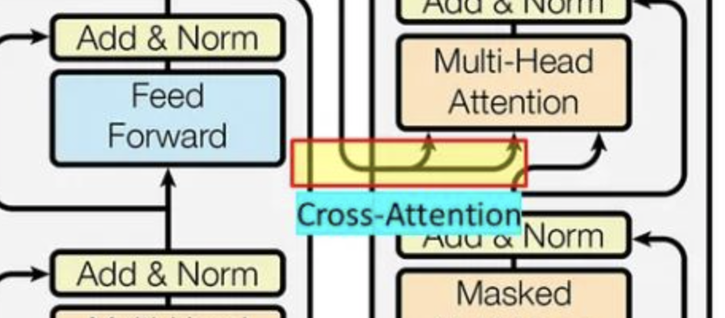
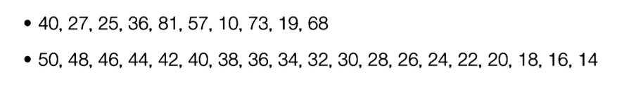

## learning-AI  : deep learning application (61357002)
### topic 7

<br>

- **임규연 (lky473736)**
- 2024.10.17.

------

### 복습

- **flow**
    - FCNN -> CNN : FCNN은 local feature를 추출해낼 수 없음 (공간적인 특성, 그니깐 인접한 픽셀들과 같이 local정보를 추출)
    - CNN -> RNN : CNN은 현재 상태만 반영하고, 이전의 시점을 반영하지 못함 (CNN / 데이터의 추세를 모델의 학습에 반영하기 위해서)
    - RNN -> LSTM : gradient vanishing problem을 해결 (cell state를 도입, 장기기억과 단기기억 / long short term memory)
    - LSTM -> GRU : 계산양을 감소함 

- **해결해야 할 것** : gradient vanishing problem + number of parameter을 줄이기 + 성능은 높이기
- **해결하기 위해 도입된 네트워크 (Variant of CNN)**
    - ResNet : skip-connection (shortcut)
        - gradient vanishing problem 해결
        - 잔차 학습을 도입하여 학습 용이하게 함
    - SENet : 채널에 대한 중요도 매기고 학습 용이 (기존 CNN에서의 채널의 중요도는 모두 동일하였다 -> SENet으로 중요도 매기고 중요한 채널만 온전히 학습하자)
        - 채널 중요도 추출은 pooling을 이용
        - channel attention
        - **그러면 중요한 것만 집중하자 -> attention이 등장!**
    - inception : 서로 다른 필터를 적용 -> 서로 다른 특성을 뽑음
        - 1*1 
    - depth-wise seperator convolution : CNN보다 훨씬 lightweight하게 학습할 수 있다 
        - Depthwise Separable Convolution
            - Step 1: Depthwise Convolution
            Convolution에서는 모든 입력 채널을 고려하여 하나의 필터를 적용하지만, 
            Depthwise Convolution에서는 각 채널마다 별도의 필터를 사용. 
            이로 인해 채널 간의 상호작용은 고려되지 않고 각 채널은 독립적으로 처리
            - Step 2: Pointwise Convolution
            Depthwise Convolution을 통해 각 채널별로 처리된 출력을 다시 결합하기 위해 1x1 Convolution을 적용
            이 과정에서 채널 간의 상호작용을 고려하며, Depthwise Convolution으로 축소된 연산 비용을 보충
       - **채널을 각자 다른 필터를 적용하고 나중에 합친다**
       - Xception은 step2 -> step1
    - CBAM : Channel attention -> Spatial attention
        - pooling layer을 이용하여 특성을 추출
- **transformer**
    - self-attention : 필요한 정보에만 집중
        - 데이터가 굉장히 많이 나올 때, 어느 부분을 집중할 것인가? 
            - 나는 오늘 밥을 먹었어 <- 여기서 **먹었어**가 가장 중요함
            - 동요 **반달**을 각각 translator와 gpt를 이용하여 번역
                - google : Blue sky, Milky Way, white boat, one cinnamon tree, one rabbit
                - gpt : "Blue sky, Milky Way, on the white little boat One laurel tree, one rabbit."
                - **gpt가 더 문맥을 잘 받아들임**
                    - parameter가 더 많음
                    - self-attention. white little boat라고 하는 것에 중점을 두어서 해석함 (**attention score**)
    - multi-head attention : 병렬적으로 attention score을 동시에 구하자
    - embedding
        - one-hot encoding의 단점 : 만약에 너무 정보가 많아지면 차원수가 너무 많아짐
        - 그래서 vector embedding으로 변경 (유사도 / 가까운 거리를 재기)
    - positional encoding
        - 데이터의 순서를 고려하지 않기 때문에, 각 단어의 위치 정보를 포함한 **positional encoding**을 추가해 순서를 학습함
        - **예시** : "나 너 돈줘"와 "너 나 돈줘"는 단어 순서만 다르지만 의미가 달라지므로, 위치 정보를 포함해 이를 학습.

    - **cross attention (NEW)**
        - 
        - class 참고

### AutoEncoder


- https://keraskorea.github.io/posts/2018-10-23-keras_autoencoder/
- 기존 MLP 방식과 달리 인코더-디코더 구조를 가짐. 인코더는 데이터를 압축하여 **latent vector**를 생성하고, 디코더는 이를 다시 복원.

- **Structure**
    - 인코더는 입력 데이터를 점차 축소해 핵심 정보를 추출하고, 디코더는 이를 바탕으로 데이터를 복원.
    - **예시** : 64x64 이미지가 인코더에서 32x32로 압축되고, 디코더에서 다시 64x64로 복원됨.
- **Self-supervised Learning** : 레이블이 없는 데이터를 사용하여 학습. 입력 데이터 자체를 복원하는 과정을 통해 모델이 학습됨.
    - **예시** : 손상된 이미지에서 원본 이미지를 복원하거나, 노이즈가 추가된 데이터에서 원래 데이터를 복원.
- **Latent Vector (Latent Space)** : 인코더가 생성한 **압축된 표현**으로, 중요한 정보만을 담고 있음.
    - 
    - 위 수열 중 외우기 쉬운건 아래다. 패턴이 있기 때문에 아무리 길어도 외우기 편하다 (latent space의 진짜 의미)
    - **예시** : 원래의 고차원 데이터를 저차원 공간에 투영하여, 중요한 정보는 유지하면서 데이터 양을 줄임.
- **Reconstruction Error** : 입력 데이터와 복원된 데이터 간의 차이. 이 차이가 클수록 모델이 데이터를 잘 복원하지 못한 것.
    - **예시** : 손상된 이미지에서 원본과 복원된 이미지의 차이를 계산하여 reconstruction error를 평가.
- **Anomaly Detection** : 정상적인 데이터를 학습한 후, 이상 데이터를 복원하지 못해 높은 reconstruction error가 발생하는 것을 기반으로 이상치를 탐지.
    - **예시** : 신용카드 거래에서 정상 거래는 잘 복원되지만, 이상 거래는 복원 오차가 크게 발생하여 이를 탐지.
- **Manifold Learning** : 고차원 데이터를 저차원 공간으로 표현하여 중요한 특징을 학습하는 방식.

- **PCA vs AE (auto-encoder)**
    - 입력과 출력이 유사하게 되도록 
    - 둘 다 encoder임 -> 결국엔 encoder로 latent space를 만들고 DNN 붙여서 출력해낼 수 있음
    - **AE를 사용하는 목적 : dimensionality reduction**
        - **PCA** : 주성분 분석, eigenvalue를 이용하여 축소시킴 (PCA 전과 PCA 후를 비교하였을 때 무조건 PCA하여서 성능이 좋지 않을 수 있다)
        - **AE** : encoder-decoder 방식 
            - 입력 $x$ -> encoder로 latent space를 만듦 (**데이터를 압축한 버전**)
            - -> latent space를 보고 decoder로 다시 복호화 -> 출력 $x hat$
            - **reconstruction error** : $x hat - x$ (MSE, MAE, RMSE, RMAE)
            - 만약에 강아지 사진으로 AE를 학습시켰을 때 고양이 사진이 들어오면 이상치라고 반응 -> AE로 **anomaly detection**할 수 있게 됨
                - 차이가 크다 -> 에러가 난다 
                - MSE, MAE를 reconstruction error로 많이 사용 
            - encoder가 제일 중요함 (latent space를 만드는게 목적이니깐)

- linear AE : encoder와 decoder의 node가 대칭 (8, 4, 2, 2, 4, 8)
- non-linear AE : encoder와 decoder의 node가 비대칭 (16, 8, 4, 6, 12, 16)
- **신기한건 non-linear AE가 성능이 더 좋을 수도 있음**

### attention의 종류
- **Scaled Dot-Product Attention**
    - 쿼리 벡터(Q)와 키 벡터(K) 간의 dot product를 계산하여 유사도를 측정
    - 스케일링하고, 소프트맥스 함수를 사용하여 가중치를 계산
    - 계산 과정에서 발생하는 값의 크기 문제를 해결

- **루옹 어텐션 (Luong Attention)**
    - 2015년 루옹 등(Luong et al.)이 제안한 방식
    - 전역 어텐션(Global Attention): 모든 입력 시퀀스의 은닉 상태(hidden states)에 대해 가중치를 계산하고, 이를 이용하여 출력값을 생성
    - 지역 어텐션(Local Attention): 입력 시퀀스의 일부에 대해서만 어텐션을 계산, 모델이 입력 시퀀스의 특정 부분에 집중하도록 제한하는 방식
    - https://machinelearningmastery.com/the-luong-attention-mechanism/

- **바다나우 어텐션 (Bahdanau Attention)**
    - 2014년 바다나우 등(Bahdanau et al.)이 제안한 어텐션 기반의 RNN 모델에서 사용
    - 디코더의 이전 상태, 인코더의 은닉 상태, 그리고 가중치 행렬을 사용하여 비선형 변환을 통해 가중치를 계산
    - 닷-프로덕트보다 복잡하지만, 모델이 학습할 수 있는 파라미터가 더 많이 포함되어 있어 다양한 경우에 유연하게 대응
    - https://machinelearningmastery.com/the-bahdanau-attention-mechanism/

- **masked self attention**
    - transformer 기반 모델에서 attention 계산 시 불필요 정보나 원하지 않은 정보를 걸러내는 중요한 역할
    - Causal Mask (미래 정보 차단)
        - 문장의 각 단어를 예측할 때, 이후에 나올 단어를 미리 알게 되면 잘못된 학습이 이루어짐
        - (예: "I am going to the ..."에서 <the>를 예측할 때, 그 이후 단어인 <park>에 접근하면 예측의 의미가 없어짐
        - 따라서, 어느 시점이후에는 단어를 참조할 수 없도록 마스킹
    - Padding Mask (패딩 정보 무시)
        - Padding Mask는 모델 입력 시 길이가 다른 문장들을 동일한 길이로 맞추기 위해 추가된 패딩을 처리할 때 사용

### layer normalization vs batch normalization
- 각 feature의 scale이 다르면 당연히 모델이 정확해지지 않음
- **batch normalization**
    - batch마다 각 분포 변화를 줄여줌 -> 내부 공변량 변화를 완화 
    - 축구선수가 어느때는 잘하고 어느때는 못한다 -> 감독이 관리하기 어려움 -> 배치마다 평균과 분산을 이용하여 normalization
    - 배치마다하면 너무 어렵지 않을까 -> layer normalization
- **layer normalization**
    - https://sh-tsang.medium.com/review-layer-normalization-ln-6c2ae88bae47
    - 위 블로그 읽어보기

### vision transformer
- https://kimjy99.github.io/%EB%85%BC%EB%AC%B8%EB%A6%AC%EB%B7%B0/swin-transformer/
- https://medium.com/@sanjay_dutta/flower-image-classification-using-vision-transformer-vit-50b71694cda3
- https://github.com/sanjay-dutta/Computer-Vision-Practice/tree/main/Vit_flower
- transformer은 기본적으로 전체적인 global 정보를 추출해야 함 (문맥처럼) / 하지만 기존 CNN은 그러지 못함 (부분부분 단위)
    - -> local feature extraction과 global feature extraction을 동시에 하고 싶다 == CNN (local) + transformer (global)
    - 귀납적 추론
        - > 귀납적 추론(특정한 예에서 일반적인 규칙을 도출하는 과정)을 할 때 우리가 무의식적으로 사용하는 "편향된 기대"입니다. 이 편향은 불완전한 정보에서 결론을 내릴 때 도움이 되지만, 때로는 잘못된 결론을 내리게 할 수도 있어요. 예를 들어, 아이가 여러 번 강아지를 봤을 때 "털이 많은 동물은 모두 강아지다"라고 생각한다면, 이 아이의 귀납적 편향은 "털이 많은 동물은 강아지일 가능성이 높다"라는 가정이 되는 거예요. 이런 편향 덕분에 아이는 새로운 상황에서 빠르게 결론을 내릴 수 있지만, 이 결론이 항상 맞는 것은 아니죠. 예를 들어, 고양이도 털이 있지만 강아지는 아니잖아요.
        - > **귀납적 추론**은 개별적인 예시에서 일반적인 규칙을 도출하는 과정입니다. **ViT(Vision Transformer)**는 이미지를 작은 패치로 나눈 후, 패치들 간의 관계를 학습해 이미지를 이해하는 모델이에요. 둘의 관계는, ViT도 많은 이미지 데이터를 통해 패턴을 학습하고 이를 새로운 데이터에 적용하는 **귀납적 추론**을 사용한다는 점이에요. 하지만 ViT는 CNN과 달리, 이미지의 공간적 구조에 대한 사전적인 규칙(귀납적 편향)을 덜 사용해 더 유연한 패턴 인식이 가능합니다.

### denoising AE : 모델이 노이즈가 있는 데이터에서 원래의 깨끗한 데이터를 복원하도록 학습
- masked learning : mask를 일부러 하여서 예측하게 되면 훨씬 더 모델이 강건해짐 (일반화성능)
- 구성 순서
    - 데이터를 train, test로 나눈다
    - -> 각 데이터에 노이즈를 준다 
    - -> train + noise / test + noise
    - -> train + noise에서 normal만 빼가지고 학습 (val set은 여기서 noise를 안준거)
    - -> reconstruction error 구할 때 test + noise 
- ``` > 이 방법은 **Denoising Autoencoder(Denoising AE)**를 구성하는 과정인데, 이를 통해 모델이 노이즈가 있는 데이터에서 원래의 깨끗한 데이터를 복원하도록 학습하는 과정입니다. 하나씩 설명해볼게요.

    > ### 1. **데이터를 train과 test로 나눈다**
    - 모델을 학습시키기 위해 **훈련용(train)** 데이터와 **검증용(test)** 데이터를 분리합니다. 훈련 데이터는 모델이 학습하는 데 사용하고, 검증 데이터는 학습이 잘 되었는지 평가하는 데 사용하죠.

    > ### 2. **각 데이터에 노이즈를 준다**
    - 여기서 **노이즈를 추가**하는 이유는, 모델이 노이즈가 있는 데이터에서 원래 데이터를 복원하는 능력을 학습하기 위함입니다. Denoising AE는 본래 **손상된 데이터(노이즈가 포함된 데이터)에서 깨끗한 데이터를 복원**하는 데 특화된 모델이므로, 학습 데이터에 노이즈를 넣어 모델이 이를 처리하도록 만드는 거죠.

    > ### 3. **train + noise / test + noise 구성**
    - **훈련 데이터**와 **검증 데이터**에 각각 노이즈를 추가합니다. 이로 인해 훈련 중 모델은 노이즈가 섞인 데이터를 입력받고, 이 데이터를 복원해야 합니다.
    - **train + noise**는 노이즈가 추가된 훈련 데이터입니다. 모델은 이 데이터에서 깨끗한 데이터를 복원하는 법을 배우게 됩니다.
    - **test + noise**는 검증 과정에서 사용될 노이즈가 추가된 테스트 데이터입니다. 학습한 모델이 노이즈를 잘 처리하는지 평가할 때 사용됩니다.

    > ### 4. **train + noise에서 정상 데이터(normal)만 빼서 학습**
    - 이 과정에서 **정상 데이터**만 복원하도록 학습합니다. Denoising AE는 노이즈가 있는 데이터를 입력받고, 그 안에서 원래의 깨끗한 데이터만 복원하는 것을 목표로 하기 때문에, 노이즈를 제거한 정상 데이터를 기반으로 학습하는 것이 핵심입니다.
    - **val set(검증용 데이터)**는 여기서 노이즈가 없는 깨끗한 데이터로 남겨두어, 모델이 학습 중 과적합(overfitting)되지 않도록 중간 평가에 사용됩니다.

    > ### 5. **Reconstruction Error 구할 때 test + noise**
    - **Reconstruction Error(복원 오류)**는 노이즈가 있는 입력 데이터(test + noise)와 모델이 복원한 데이터 간의 차이를 측정하는 지표입니다.
    - 테스트 데이터에도 노이즈가 추가된 상태에서 모델이 얼마나 잘 복원했는지 확인할 때 사용되며, 이 오류가 작을수록 모델이 잘 작동한 것입니다.

    > ### 왜 이런 순서로 구성되었는가?
    1. **노이즈를 학습시킴**: 모델이 노이즈가 포함된 데이터를 보고 원래의 데이터를 복원하는 법을 배워야 하기 때문에 훈련 데이터와 테스트 데이터에 모두 노이즈를 추가합니다.
    2. **정상 데이터만 사용**: 훈련 중에는 깨끗한 데이터를 복원하는 법을 학습시켜야 하므로, 노이즈를 제거하고 정상적인 데이터에 집중하게 합니다.
    3. **Reconstruction Error를 계산**: 학습한 모델이 실제로 노이즈가 있는 데이터에서 얼마나 잘 복원했는지 평가하기 위해, 복원된 데이터와 실제 깨끗한 데이터 간의 차이를 측정합니다. ```


### 과제, 실습
    - linear AE
    - non-linear AE
    - LSTM, Conv을 이용하여 AE 만들기 (순환 데이터로 구성)  -> 이러면 reconstruction이 3차원이 나올텐데 그걸 flatten
    - denoising AE
        - lyingback + lyingRight
        - sitting (abnormal)