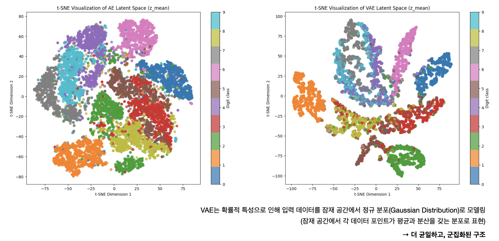
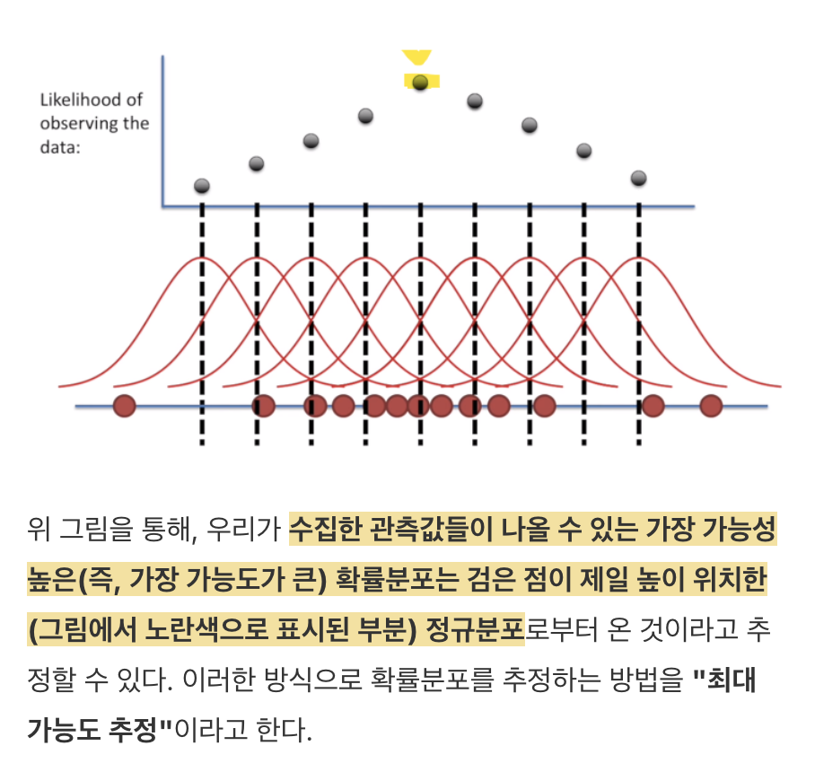

## learning-AI  : deep learning application (61357002)
### topic 9

<br>

- **임규연 (lky473736)**
- 2024.10.31.

------

- 발표자료 모두 시험에 나온다
- 나중에 기말고사 공부할거 다 알려줌 (아마 기말고사 전 주에 reviewing할 때?)

```
VAE

1. Likelihood (우도)란 무엇인가?

https://youtu.be/XepXtl9YKwc?si=chiDUt46Fl3Z84a7
https://jjangjjong.tistory.com/41
https://data-scientist-brian-kim.tistory.com/91

2. VAE

https://medium.com/@hugmanskj/hands-on-understanding-and-implementing-variational-autoencoders-1013b658d216
https://medium.com/@hugmanskj/autoencoder-%EC%99%80-variational-autoencoder%EC%9D%98-%EC%A7%81%EA%B4%80%EC%A0%81%EC%9D%B8-%EC%9D%B4%ED%95%B4-171b3968f20b
https://hugrypiggykim.com/2018/09/07/variational-autoencoder%EC%99%80-elboevidence-lower-bound/

3.  변분 추론(Variational Inference)

https://medium.com/@david.daeschler/the-amazing-vae-part-2-06927b916363
https://medium.com/@rukshanpramoditha/a-comprehensive-guide-to-variational-autoencoders-vaes-708be64e3304

- 실제 데이터 분포 p(x)에 가장 가까운 데이터를 생성하는 모델의 매개변수를 학습하고 싶음
- 베이즈 정리를 사용하여 posterior probability p(Θ|X)를 계산해야 함
- 하지만, 수학적 난해성 때문에 p(Θ|X)를 직접 계산할 수 없음
- 따라서, 복잡한 확률 분포로 근사값을 찾음
- 이를 위해서, 잠재 공간의 분포가 정규 분포(e.g Gaussian, Bernulli)를 따를 것이라고 가정하고 잠재 변수 𝑧를 샘플링
(잠재 공간을 점 추정하는 것이 아니라 공간을 샘플링,  Z ≈ N(µx, σx))
- 직접 샘플링하면 미분이 불가능해지므로, 재파라미터화 트릭(Z = μ + σϵ)형태로 변환
- ϵ은 표준 정규 분포 N(0,1)로부터 샘플링된 노이즈
- 샘플링된 z는 디코더로 전달되어 원본 데이터 x와 유사한 데이터를 생성하는 데 사용
- VAE의 목적 함수는 Evidence Lower BOund(ELBO)을 최대화
- ELBO는 재구성 오차와 KL 발산의 합으로 구성
- 재구성 오차는 입력 데이터와 재구성된 데이터 간의 차이를 최소화
- KL 발산(Kullback-Leibler Divergence)은 두 확률 분포 간의 차이를 측정하는 지표
- VAE에서 KL 발산은 <인코더가 학습한 잠재 변수의 분포>와 모델이 원하는 목표 분포(일반적으로 표준 정규 분포) N(0,1)) 사이의 차이를 최소화하는 데 사용
```

### 왜 딥러닝에서 이진 분류와 다중 분류의 손실 함수는 다른가 (GPT)
딥러닝에서 이진 분류와 다중 분류의 손실 함수가 다른 이유는, 예측하고자 하는 클래스의 수와 예측 확률을 계산하는 방식이 다르기 때문이다. 

1. **이진 분류(Binary Classification)**: 
   - 두 가지 클래스(0과 1)로 데이터를 분류할 때 사용하며, 각 데이터가 특정 클래스에 속할 확률을 예측한다.
   - 일반적으로 **Binary Cross-Entropy Loss** 또는 **Log Loss**를 사용한다. 이진 분류에서는 최종 출력층에 **시그모이드 함수**를 적용하여 결과값을 0과 1 사이의 확률 값으로 변환한다.
   - 시그모이드 함수는 단일 확률 값(한 클래스에 속할 확률)을 계산하기 때문에, 두 클래스 중 하나에 속할 확률만 고려해 손실을 계산하면 된다.

2. **다중 분류(Multi-Class Classification)**: 
   - 세 개 이상의 클래스 중 하나로 데이터를 분류하는 경우에 사용된다.
   - **Categorical Cross-Entropy Loss**를 사용하며, 최종 출력층에 **소프트맥스 함수**를 적용하여 각 클래스에 속할 확률을 계산한다.
   - 소프트맥스 함수는 모든 클래스에 대한 확률을 합이 1이 되도록 계산한다. 이를 통해 각 클래스에 속할 확률을 비교하면서 가장 높은 확률의 클래스를 예측할 수 있다.

결론적으로, 이진 분류는 각 데이터가 두 클래스 중 어느 하나에 속할 확률을 고려하고, 다중 분류는 여러 클래스 중 하나를 선택하기 위해 전체 확률 분포를 계산하므로 손실 함수와 출력층의 활성화 함수가 다르게 적용된다. 결국엔 정규 분포와 input 분포가 가깝게 구성되도록 조정하는 것이다.

<mark><b>결국엔 binary crossentropy와 categorical crossentropy의 확률분포가 다르기 때문이다.</b></mark>

### latent space vs latent vector
- **latent space** : 여러 개
- **latent vector** : 1개

### VAE



- encoder의 목적 : 어떤 특징들을 압축하고 정보 추출 (핵심적, latent space)
    - 입력 데이터를 고차원 공간에서 저차원 벡터로 변환하는 역할을 수행
    - 텍스트, 이미지, 음성과 같은 데이터를 압축하여 핵심적인 정보를 저차원으로 표현
- decoder의 목적 : Encoder가 추출한 저차원 벡터(잠재 공간)를 다시 원래의 고차원 데이터 형식으로 복원
- VAE vs AE (차이점)
    - AE : latent vector를 추출함, 
    - VAE : **latent space를 추출함**, 
    - **결국엔 생성형 AI은 입력 데이터로부터 latent vector나 latent space를 추출하여, 그 latent space로부터 새로운 데이터를 생성**
- **오토인코더의 모든 것** : https://www.youtube.com/watch?v=o_peo6U7IRM
- likelihood (https://data-scientist-brian-kim.tistory.com/91)
    - 확률 : 가능성. 어떤 event가 일어날 가능성
        - 
        - **분포로부터 데이터**
    - **likelihood는 데이터로부터 분포를!**
    - MLE : Maximum Likelihood
        - 
        - 데이터는 확률분포로 변할 수 있다. 데이터를 통해 확률분포를 예측할 수 있다. -> likelihood
- VAE의 loss == reconstruction error + KL Divergence (두개의 분포의 차이)
    - 원래 데이터를 가우시안 분포로 가정하는 것. (N(0, 1)) 이러면 평균과 분산을 알면 샘플링 쉬움. 원본 데이터로부터 샘플링.
    - 결국엔 정규분포와 input의 분포를 이용하여 variational inference (변분추론)하여 근삿값을 찾는 것
    - 재파라미터 트릭 
    - ELBO

### GAN


- latent space (샘플 noise vector)을 generator에 대입 -> 가짜 데이터 생성 -> 가짜 데이터랑 실제 데이터를 Discriminator에 넣음 -> 가짜 데이터를 평가하여 generator에 back propagation
- GAN과 VAE의 차이점
    - GAN : 경쟁 **게임 이론**, 기존과 비슷하지만 다양한 양상
    - VAE : 수학적으로 엄밀히 정의, 기존의 것을 가능한 한 유사하게
- **G loss와 D loss는 위와 같은 형태가 이상적이다**
- vanilla -> original GAN (Dense) -> **mode collapse** -> 해결하고자 한 것이 DCGAN이다
    - mode collapse : 반대로 Generator가 지나치게 잘 학습되면, Discriminator가 생성된 이미지를 효과적으로 구분하지 못하게 되고, Generator는 특정한 종류의 이미지만 계속 생성하게 됨
        - 잘못된 방향으로 계속 Generator가 생성하지만, Discriminator가 그걸 진짜 데이터라고 판단하는 것