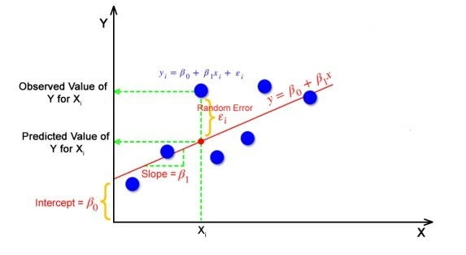

## 딥러닝/Pytorch 단기프로그램 (바이오헬스의료기기융합전공 주최)
### day 1 

 

#### 머신러닝과 딥러닝 개요 
- <b>인공지능(MOOC), 기계학습프로그래밍, 딥러닝응용이나 ai책에서 수도 없이 보고 들었던 내용이니깐 그냥 글로만 정리해놓자</b>
- 차이점
    - 머신러닝 : 사람이 feature extraction해야 함
    - 딥러닝 : network 안에서 feature extraction 자동으로 함
- | supervised | unsupervised | reinforcement |
  | ---------- | ------------ | ------------- | 
  | input, target | input, no target | input(항상 동일하지 않음), no target | 
    - "항상 동일하지 않음" <- 상황에 따라서 강화학습의 주체가 변동될 수 있다
- 학습 과정의 예시
    - {1, 2, 3, 4, 5}라는 정의역과 {2, 4, 6, 8, 10}이라는 치역이 있을 때, y = ax+b의 parameter를 알아내야함. 
        - (1) a, b의 초기값 (random)
        - (2) x를 입력하여 f(x) 값 도출
        - (3) 오차 계산 (loss function)
        - (4) 오차가 0에 수렴하도록 수정 -> 1~3 반복 (back propagation)
- RNN, LSTM, Seq2Seq, transformer, AlexNet, LeNet, GoogLeNet, ResNet, GAN, VAE ...

#### linear regression with Pytorch

- 순서
    - (1) X, y 데이터 생성
    - (2) a, b 초기값 설정
    - (3) loss function 설계 (오차제곱법 MSE)
    - (4) y와 f(x)의 오차 계산
    - (5) 오차 이용하여 a, b 변화량 계산
    - (6) 변화량 토대로 얼마나 값 변경할 지 결정
    - (7) a, b 변경
    - 4-7 반복하여 오차를 최소화